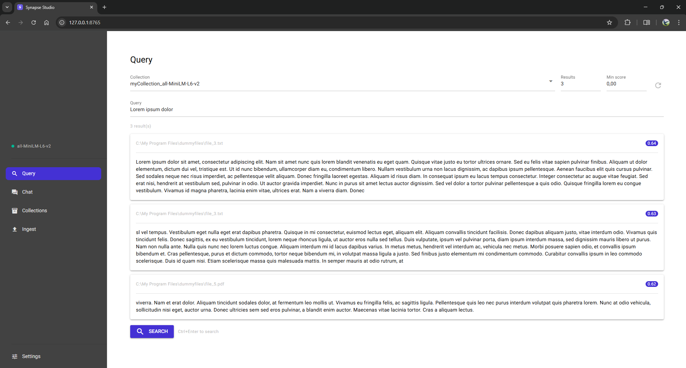

<div align="center">
  <br/><br/>

  <h1>Synapse Studio</h1>
  <p><strong>Native desktop GUI for <a href="https://github.com/adm-crow/synapse">synapse-core</a> — ingest documents, search semantically, chat with your data.</strong></p>


</div>

---

No cloud, no browser, no infrastructure. Synapse Studio runs entirely on your machine as a native desktop window — point it at a folder, ingest, and start searching or chatting with your documents.

| | |
|---|---|
| **Query** | Semantic search with score filtering and result cards |
| **Chat** | RAG-powered AI chat using your documents as context |
| **Collections** | Browse, inspect, and manage vector collections |
| **Ingest** | Index a local folder with real-time progress and model mismatch detection |
| **Settings** | Provider, model, API key, embedding model, theme, dark mode |

---

## Screenshots

<div align="center">
  
</div>

---

## Install

```bash
pip install synapse-studio
```

> [!NOTE]
> To support additional file formats (`.html` `.pptx` `.xlsx` `.epub` `.odt`), install the `formats` extra of synapse-core:
> ```bash
> pip install "synapse-core[formats]"
> ```

---

## Usage

```bash
synapse-studio
```

The app opens as a native desktop window. On first launch, go to **Settings** and configure:

- **DB path** — where your vector database is stored (default: `./synapse_db`)
- **Embedding model** — any [sentence-transformers](https://huggingface.co/models?library=sentence-transformers) model (default: `all-MiniLM-L6-v2`)
- **AI provider / model / API key** — required for the Chat tab (Anthropic or OpenAI)

Then open **Ingest**, pick a folder, and click **Start Ingest**. Use **Query** or **Chat** once ingestion is complete.

---

## Supported file formats

`.txt` `.md` `.csv` `.pdf` `.docx` `.json` `.jsonl` `.html`* `.pptx`* `.xlsx`* `.epub`* `.odt`*

*requires `synapse-core[formats]`

---

## Embedding models

Any model from [Hugging Face sentence-transformers](https://huggingface.co/models?library=sentence-transformers&sort=downloads) works — paste the model name directly into **Settings → Embedding model**.
See the [MTEB Leaderboard](https://huggingface.co/spaces/mteb/leaderboard) to compare quality.

| Model | Dims | Notes |
|---|---|---|
| `all-MiniLM-L6-v2` | 384 | Default — fast, lightweight |
| `BAAI/bge-base-en-v1.5` | 768 | Better quality, good speed |
| `BAAI/bge-large-en-v1.5` | 1024 | Best quality, slower |
| `paraphrase-multilingual-MiniLM-L12-v2` | 384 | Multilingual (50+ languages) |

> [!WARNING]
> Each collection is tied to the model used at ingest time. Do not mix models within the same collection — Synapse Studio will warn you if a mismatch is detected before ingesting.

---

## Configuration

Settings are saved to `synapse.toml` in the working directory. This file is excluded from version control (`.gitignore`) as it contains local paths and API keys.

---

## Requirements

- Python 3.11+
- [synapse-core](https://github.com/adm-crow/synapse) ≥ 1.1.1 (installed automatically)

---

<div align="center">
  <sub>
    <a href="https://github.com/adm-crow/synapse">synapse-core</a> ·
    <a href="https://pypi.org/project/synapse-core/">PyPI</a> ·
    <a href="LICENSE">MIT</a>
  </sub>
</div>
